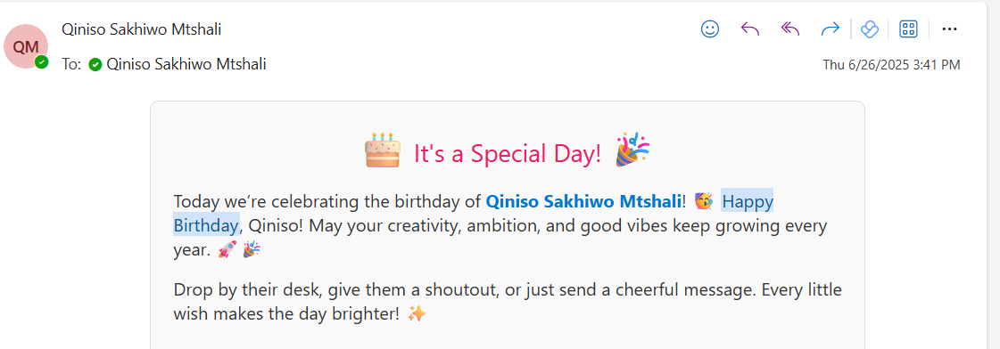

# 🎉 Birthday Automation Flow

> *Automated birthday reminders and celebrations using Power Automate, SharePoint, Teams & Outlook.*

---

## 🧠 Project Summary

The **Birthday Automation Flow** is a fully automated system that:

- ⏰ Sends **reminder emails** the day before a colleague's birthday
- 🥳 Sends **birthday wishes** via **Teams** and **Outlook** on the actual day
- 💬 Supports **personalized messages** per user
- 📅 Uses a **SharePoint list** to manage birthdays and messages

This solution boosts morale, improves team culture, and saves time — all while running 100% automatically.

---

## 🔧 How It Works

### 🔹 1. **Trigger**
- A **daily recurrence** trigger checks birthdays every morning.

### 🔹 2. **Data Source**
- A **SharePoint list** stores:
  - Full Name
  - Date of Birth
  - Email
  - Teams Username (optional)
  - Custom Message (optional)

### 🔹 3. **Reminders & Wishes**
- 📬 On the day **before**:
  - Sends a friendly **email reminder** to management or team leads.
- 🎂 On the **birthday**:
  - Sends a **Teams message** (using webhook or Teams connector)
  - Sends a **personalized email** to the birthday person

---

## 📁 SharePoint List Structure

| Column Name      | Type           | Example Value         |
|------------------|----------------|------------------------|
| `Full Name`      | Text           | Zinhle Nkosi           |
| `Email`          | Text (Email)   | zinhle@company.com     |
| `Birthday`       | Date Only      | 1996-07-10             |
| `Message`        | Multiline Text | Happy Birthday, Zinhle! We appreciate your creativity and warmth. 🎈 |
| `TeamsUsername`  | Text (Optional)| @zinhle.nkosi          |

---

## 🛠️ Tools Used

| Tool              | Purpose                               |
|-------------------|----------------------------------------|
| **Power Automate**| Core logic for reminders and emails    |
| **SharePoint**    | Stores birthday data                  |
| **Microsoft Teams** | Sends celebration messages            |
| **Outlook**       | Sends reminders & wishes               |

---

## 🎯 Highlights

- 🔄 Fully automatic — no manual triggers
- 🧠 Personalized messages via dynamic content
- 🗓️ Respects leap years and cross-year logic
- 🤝 Easily extendable to send SMS, GIFs, or adaptive cards

---

## 🚀 Status

✅ **Live & working across the team**  
📅 Configured to run every morning at 08:00  
🎉 Helps the company celebrate people meaningfully

---

## 📸 Screenshots

  

---

## 📫 Questions or Collaboration?

Reach out on:

- 🔗 [LinkedIn](https://linkedin.com/in/qiniso-mtshali-532394173)
- 🌐 [Portfolio](https://qiniso-power-showcase.vercel.app)

---

> ⚡ Empowering teams to never forget a celebration — because people matter.
